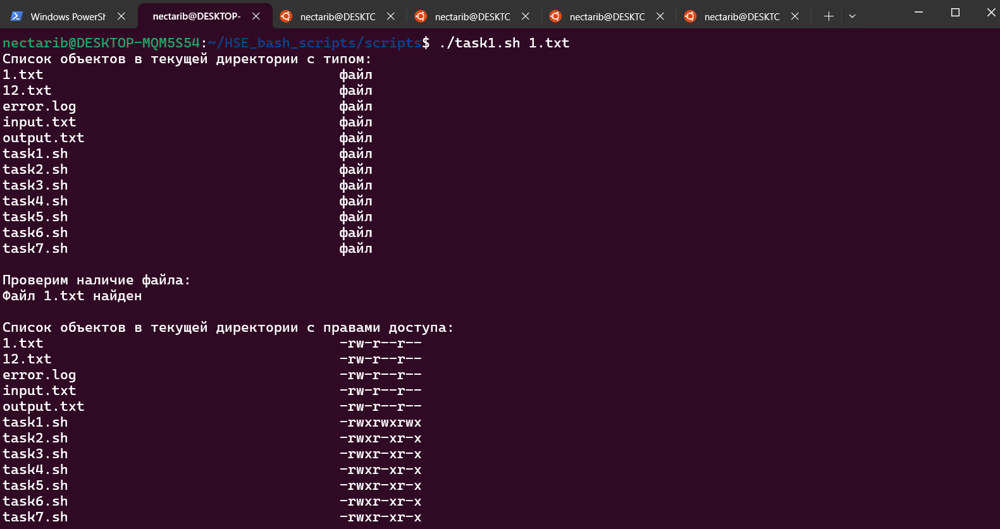
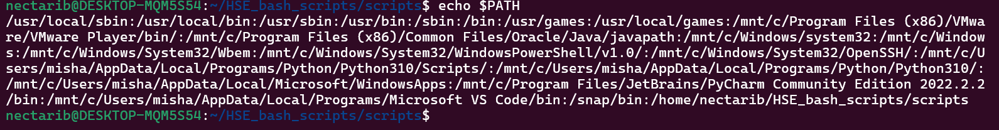
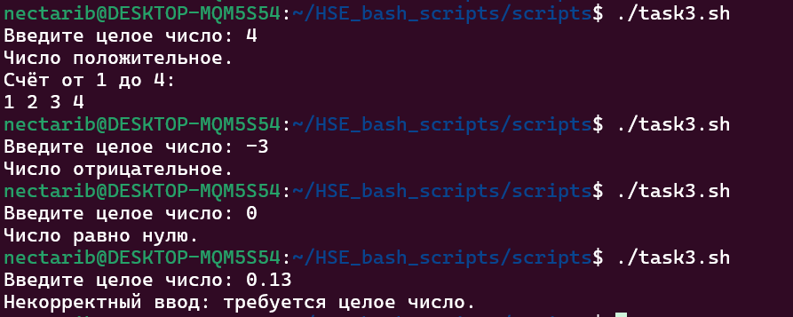
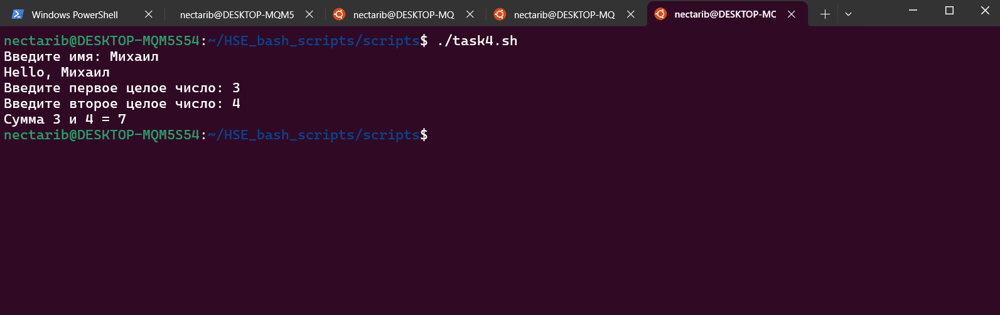
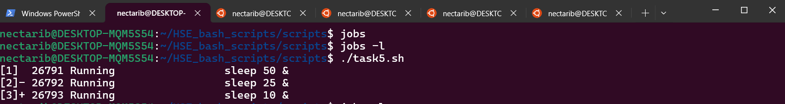
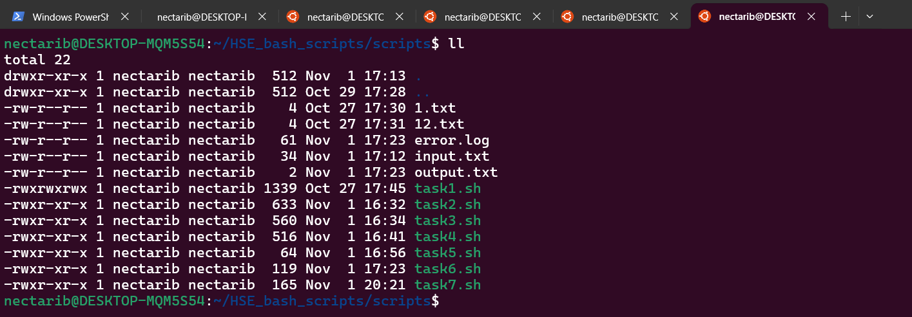
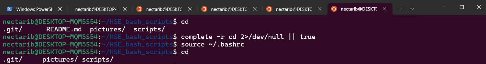

# Домашнее задание HSE DE Кислощаев.М.К. баш скрипты
## 1. Функционал Bash
Результат продемонстрирован на скриншоте "task1" в директории pictures текущего репозитория

## 2. Переменная PATH
Изменения переменной PATH в терминале действуют только в текущем процессе оболочки (bash). Когда вы закрываете терминал, процесс завершает работу — его окружение исчезает. Новый терминал запускает новый процесс bash, который читает стартовые файлы и получает «чистое» окружение, поэтому старые правки не сохраняются
Результат продемонстрирован на скриншоте "task2" в директории pictures текущего репозитория

## 3. Управляющие конструкции (условия и циклы)
Результат продемонстрирован на скриншоте "task3" в директории pictures текущего репозитория

## 4. Работа с функциями
Результат продемонстрирован на скриншоте "picture3" в директории pictures текущего репозитория

## 5. Управление процессами и фоновое выполнение
Команда jobs показывает список фоновых и приостановленных задач текущей оболочки: для каждой видны номер в квадратных скобках, PID, статус (Running/Stopped/Done) и команда. У одной задачи стоит метка «+» — это текущая, которую по умолчанию выберут fg/bg, у другой — «−» (предыдущая). Команда fg возвращает выбранную задачу на передний план: терминал «прикрепляется» к процессу, его вывод появляется на экране, и до завершения или остановки этой задачи управление не возвращается. Команда bg, наоборот, продолжает приостановленную задачу в фоне: процесс получает сигнал продолжения, снова бежит, а терминал остаётся свободным. Часто вместе с ними используют Ctrl+Z — он приостанавливает текущий foreground‑процесс (статус Stopped), после чего его можно отправить в фон через bg или вернуть на передний план через fg.

Что я наблюдал: запустил три длительные команды в фоне (sleep 50 &, sleep 25 &, sleep 10 &), и jobs показала три задания с номерами [1], [2], [3], причём у последней стояла метка «+». Выполнил fg %+ — «последняя» задача (sleep 10) вышла на передний план, терминал занялся её исполнением. Нажал Ctrl+Z — задача перешла в статус Stopped. Затем выполнил bg %+ — эта же задача продолжила работу в фоне, и повторный вызов jobs показал, что она снова Running. Далее выполнил fg %- — «предыдущая» задача вышла на передний план.

## 6. Управление процессами и фоновое выполнение
Результаты задания лежат файликами в директории scripts

## 7. Управление процессами и фоновое выполнение
Чтобы сделать alias постоянным добавим его в ~/.bashrc

Работающий alias ll продемонстрирован на скриншоте "picture7" в директории pictures текущего репозитория

Далее работа с автодополнениями продемонстрирована изменением правила автодополнений для команды cd на скриншоте "picture8" в директории pictures текущего репозитория (автодополнение для cd стало рекомендовать только директории)
